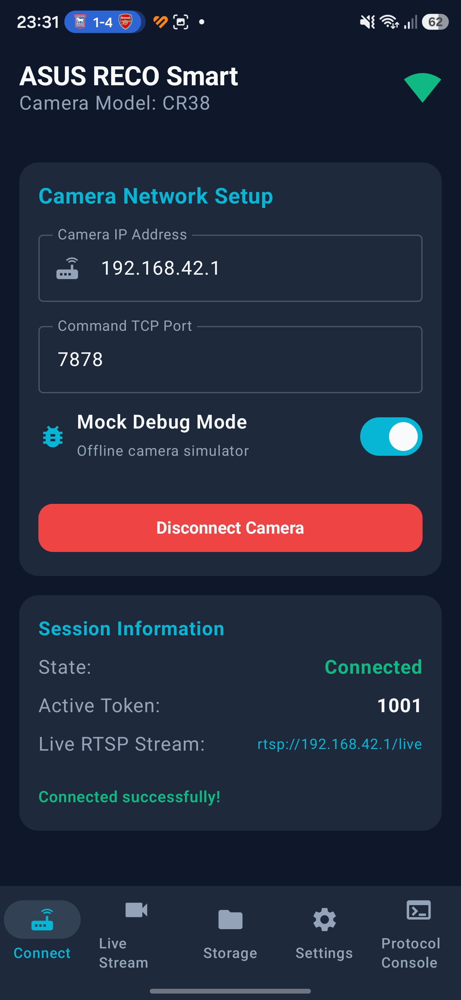
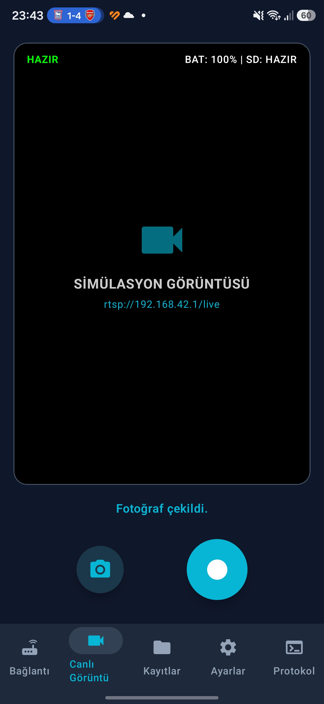
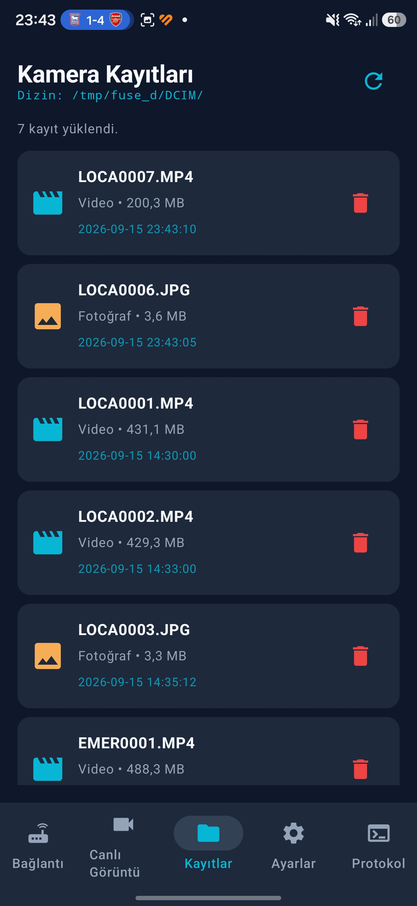
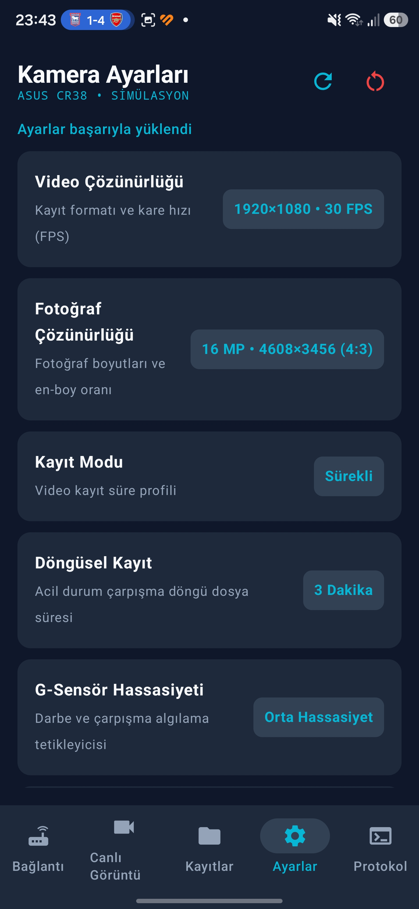
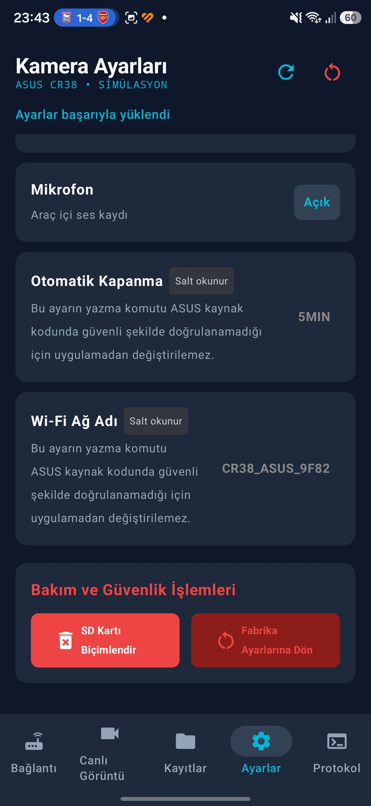
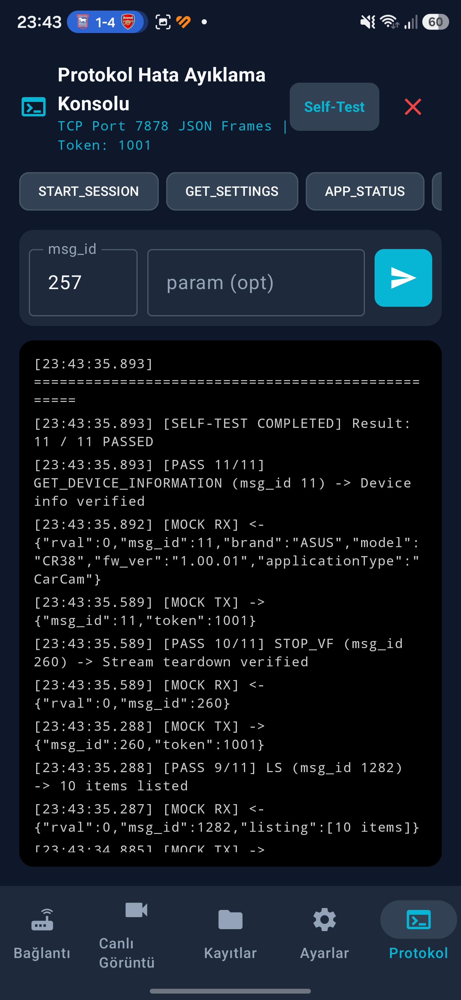

# ASUS RECO Smart / CR38 Android Client

> **Türkçe:** Bu proje ASUS RECO Smart / CR38 kamera için geliştirilen bağımsız ve resmi olmayan bir Android istemcisi ve protokol araştırma projesidir.  
> **English:** This project is an independent, unofficial Android client and protocol research application for the ASUS RECO Smart / CR38 camera.

---

# 🇹🇷 Türkçe

## 📱 Proje Hakkında

**ASUS RECO Smart / CR38 Android İstemcisi**, ASUS RECO Smart (CR38 model) araç ve aksiyon kamerasının Wi-Fi erişim noktası (Access Point) ağı üzerinden doğrudan uzaktan kontrol edilmesini, canlı yayın izlenmesini, dosya yönetimini ve düşük seviyeli TCP komut protokolü hata ayıklamasını sağlayan bağımsız bir Android uygulamasıdır.

Orijinal mobil uygulamanın eski Android sürümlerine bağımlılığını ortadan kaldırmak ve kameranın donanım protokolünü belgelemek amacıyla modern Android mimarisi (**Kotlin**, **Jetpack Compose**, **MVVM**, **Coroutines**, **Media3/ExoPlayer**) kullanılarak sıfırdan geliştirilmiştir.

> ⚠️ **Önemli Durum Bilgisi:**  
> Bu uygulama hem tam fonksiyonel bir **Simülasyon / Mock** moduna hem de gerçek **Kamera Ağ Sürücüsüne** sahiptir.  
> **Fiziksel ASUS CR38 üzerindeki gerçek donanım doğrulaması devam etmektedir.**

---

## ✨ Özellikler

- **Çift Çalışma Modu (Dual Mode)**:
  - **Simülasyon (Mock) Modu**: Donanım bağlantısı olmadan oturum başlatma, fotoğraf/video çekimi, ayar değiştirme ve SD kart dosya gezintisini %100 çevrimdışı simüle eder.
  - **Gerçek Kamera Modu**: Kameranın `192.168.42.1` Wi-Fi erişim ağına TCP soket seviyesinde doğrudan bağlanır.
- **Akıllı Ağ Yönlendirme (CameraNetworkManager)**:
  - Mobil veri aktifken kameraya bağlandığında Android'in "İnternet Erişim Yok" uyarısıyla bağlantıyı kesmesini engellemek için soketleri doğrudan CR38 Wi-Fi arabirimine kilitler (`ConnectivityManager.bindSocket`).
- **TCP Komut ve Protokol Motoru**:
  - JSON tabanlı TCP mesajlaşması (7878 Portu), `msg_id` eşleşmeli komut kilit sistemi ve dinamik `token` yönetimi.
  - Parçalanmış (fragmented) veya birleşik gelen TCP paketlerini güvenle ayrıştıran durum makineli JSON işleyicisi (`TcpResponseFramer`).
- **RTSP Canlı Görüntü Akışı**:
  - AndroidX Media3 / ExoPlayer altyapısı ile `rtsp://192.168.42.1/live` canlı yayın akışı gösterimi.
- **SD Kart ve Kamera Dosya Yöneticisi**:
  - Kamera üzerindeki `/tmp/fuse_d/DCIM/` dizinindeki fotoğraf ve videoları (`.JPG`, `.MP4`) listeleme, boyut ve tarih bilgilerini görüntüleme.
  - Yanlışlıkla silmeleri önlemek için onay diyaloglarına sahip güvenli dosya silme mekanizması.
- **Kamera Ayarları Sistemi**:
  - Görüntü çözünürlüğü, döngüsel kayıt süresi, pozlama değeri (EV), G-sensör hassasiyeti, mikrofon, zaman atlamalı çekim (time-lapse) ve sistem modlarının okunması ve yapılandırılması.
- **Protokol Hata Ayıklama Konsolu (Protocol Console)**:
  - Ham (RAW) TX/RX JSON paketlerinin gerçek zamanlı izlenmesi.
  - Özel `msg_id` ve parametre gönderim araçları.
  - **11 Adımlı Mock Self-Test** ve güvenli **Donanım Tanılama** test paketi.
  - Tek tıkla teknik protokol teşhis raporu kopyalama / dışa aktarma.

---

## 📸 Ekran Görüntüleri

<p align="center">
  
  &nbsp;&nbsp;
  
  &nbsp;&nbsp;
  
</p>
<p align="center">
  <b>Bağlantı & Oturum Yönetimi</b> &nbsp;&nbsp;&nbsp;&nbsp;&nbsp;&nbsp;&nbsp;&nbsp;&nbsp;&nbsp;&nbsp;&nbsp;&nbsp;&nbsp;
  <b>RTSP Canlı Görüntü & Çekim</b> &nbsp;&nbsp;&nbsp;&nbsp;&nbsp;&nbsp;&nbsp;&nbsp;&nbsp;&nbsp;&nbsp;&nbsp;&nbsp;&nbsp;&nbsp;&nbsp;
  <b>SD Kart Dosya Yöneticisi</b>
</p>

<br/>

<p align="center">
  
  &nbsp;&nbsp;
  
  &nbsp;&nbsp;
  
</p>
<p align="center">
  <b>Kamera Ayarlar Paneli</b> &nbsp;&nbsp;&nbsp;&nbsp;&nbsp;&nbsp;&nbsp;&nbsp;&nbsp;&nbsp;&nbsp;&nbsp;&nbsp;&nbsp;&nbsp;&nbsp;
  <b>Sistem & Güvenlik Ayarları</b> &nbsp;&nbsp;&nbsp;&nbsp;&nbsp;&nbsp;&nbsp;&nbsp;&nbsp;&nbsp;&nbsp;&nbsp;&nbsp;&nbsp;
  <b>Protokol Konsolu & Self-Test</b>
</p>

---

## 🏗️ Mimari

Uygulama, **Clean Architecture** ve **MVVM (Model-View-ViewModel)** prensiplerine uygun olarak modüler bir katman yapısıyla tasarlanmıştır:

```text
               Android UI (Jetpack Compose)
                            │
                       ViewModel
                            │
                    CameraRepository
                   /                \
  MockCameraRepository            DefaultCameraRepository
  (Çevrimdışı Simülasyon)                 │
                                  ├── CameraNetworkManager (Wi-Fi Soket Kilidi)
                                  ├── TcpSocketClient (Port 7878 Soket Motoru)
                                  ├── SessionManager (Token Yönetimi)
                                  └── Protocol Parsers (JSON Framer / Serializer)
                                          │
                                          ▼
                                ASUS RECO Smart (CR38)
```

- **Domain Katmanı**: `CameraCommand`, `CameraResponse`, `SessionState`, `CameraStatus` ve `CameraRepository` arayüzü gibi temel veri modellerini içerir.
- **Data Katmanı**: TCP soket istemcisi, paket çerçeveleyicisi (`TcpResponseFramer`), ağ yönlendiricisi ve Mock/Real depo uygulamalarını kapsar.
- **UI Katmanı**: Jetpack Compose ile yazılmış duyarlı ve koyu tema odaklı kullanıcı arayüzü bileşenleridir.

---

## 🌐 Kamera Haberleşme Parametreleri

| Parametre | Standart Değer | Açıklama |
| :--- | :--- | :--- |
| **Kamera IP Adresi** | `192.168.42.1` | CR38 Wi-Fi Ağındaki Varsayılan İletişim IP'si |
| **Komut Portu (TCP)** | `7878` | JSON Komut ve Yanıt Protokol Soketi |
| **Veri Portu (TCP)** | `8787` | Dosya Aktarım ve Binary Veri Kanalı |
| **RTSP Canlı Yayın** | `rtsp://192.168.42.1/live` | H.264 Canlı Video Akış Adresi |
| **DCIM Kök Dizini** | `/tmp/fuse_d/DCIM/` | SD Kart Ortam Dosyaları Ana Dizini |

---

## 🔬 Protokol Araştırması

Orijinal ASUS yazılımının kaynak kodlarından doğrulanmış temel komut numaraları (`msg_id`) aşağıda listelenmiştir:

| Komut Adı | msg_id | Açıklama | Durum |
| :--- | :---: | :--- | :--- |
| `GET_SETTING` | `1` | Tekil kamera ayar değerini okuma | `VERIFIED_FROM_SOURCE` |
| `SET_SETTING` | `2` | Kamera ayar değerini değiştirme | `VERIFIED_FROM_SOURCE` |
| `GET_ALL_CURRENT_SETTINGS` | `3` | Tüm mevcut ayarları JSON haritası olarak çekme | `VERIFIED_FROM_SOURCE` |
| `FORMAT` | `4` | SD Kartı biçimlendirme | `VERIFIED_FROM_SOURCE` |
| `GET_DEVICE_INFORMATION` | `11` | Cihaz donanım ve yazılım bilgilerini alma | `VERIFIED_FROM_SOURCE` |
| `START_SESSION` | `257` | İletişim oturumu başlatma ve Token alma | `VERIFIED_FROM_SOURCE` |
| `STOP_SESSION` | `258` | Aktif oturumu sonlandırma | `VERIFIED_FROM_SOURCE` |
| `RESET_TO_VF` | `259` | Canlı vizör (ViewFinder) modunu sıfırlama/başlatma | `VERIFIED_FROM_SOURCE` |
| `STOP_VF` | `260` | Canlı vizör yayınını durdurma | `VERIFIED_FROM_SOURCE` |
| `RECORD_START` | `513` | Video kaydını başlatma | `VERIFIED_FROM_SOURCE` |
| `RECORD_STOP` | `514` | Video kaydını durdurma | `VERIFIED_FROM_SOURCE` |
| `TAKE_PHOTO` | `769` | Anlık fotoğraf çekme | `VERIFIED_FROM_SOURCE` |
| `DEL_FILE` | `1281` | Belirtilen dosyayı silme | `VERIFIED_FROM_SOURCE` |
| `LS` | `1282` | Dizin içeriğini listeleme (`/tmp/fuse_d/DCIM/`) | `VERIFIED_FROM_SOURCE` |
| `CD` | `1283` | Çalışma dizinini değiştirme | `VERIFIED_FROM_SOURCE` |
| `PHOTO_BURST` | `53266` | Seri fotoğraf çekim modu | `VERIFIED_FROM_SOURCE` |
| `PHOTO_TIMELAPSE` | `53271` | Zaman atlamalı fotoğraf çekim modu | `VERIFIED_FROM_SOURCE` |

---

## 🧪 Simülasyon / Mock Modu

Proje, fiziksel kamera donanımına ihtiyaç duyulmadan geliştirme ve arayüz testleri yapılabilmesi için gelişmiş bir **Mock Camera Engine** içerir:
- Gerçekçi oturum tokenı (`1001`) üretimi.
- Fotoğraf çekiminde `LOCA000X.JPG` ve video kaydında `LOCA000X.MP4` dosyalarının simüle edilerek SD kart dizinine eklenmesi.
- 11 adımlı otomatik protokol testi (`Mock Self-Test`) ile tüm komut döngülerinin test edilerek **11/11 PASSED** doğrulaması.

---

## 🚧 Fiziksel Kamera Durumu

| Katman | Durum |
| :--- | :--- |
| **Simülasyon / Mock Modu** | ✅ `VERIFIED` (11/11 Self-Test Passed) |
| **Android Kod Tabanı & Derleme** | ✅ `VERIFIED` (Clean Build RC1) |
| **Fiziksel ASUS CR38 Donanım Testi** | ⏳ `FIELD TEST PENDING / UNVERIFIED` |

---

## ⚠️ Güvenlik

Uygulama, veri kaybını ve beklenmeyen durumları önlemek için koruma mekanizmalarına sahiptir:
- `FORMAT` (SD Kart Biçimlendirme), `DEL_FILE` (Dosya Silme) ve `FACTORY RESET` (Fabrika Ayarları) gibi yakıcı işlemler **otomatik teşhis senaryolarına dahil edilmez**.
- Bu işlemler kullanıcı tarafından tetiklendiğinde açık Türkçe uyarı onay diyalogları görüntülenir.

---

## 🛠️ Kullanılan Teknolojiler

- **Dil**: Kotlin 1.9+
- **Kullanıcı Arayüzü**: Jetpack Compose (Material Design 3)
- **Asenkron Motor**: Kotlin Coroutines & Flow
- **Medya / Video**: AndroidX Media3 / ExoPlayer (RTSP Support)
- **Ağ / Soket**: Java/Android TCP Sockets, `ConnectivityManager` Network Binding
- **Ayrıştırma**: Org.Json & Custom State-Machine Stream Framer
- **Derleme Sistemi**: Gradle 8.14 (Kotlin DSL)

---

## 🚀 Geliştirme ve Derleme

### Depoyu Klonlama
```bash
git clone https://github.com/Terabithia1572/ASUS-RECO-SMART-CR38.git
cd ASUS-RECO-SMART-CR38
```

### Derleme & Test (Windows Command Prompt)
```cmd
:: Birincil birim testlerini çalıştırma
gradlew.bat testDebugUnitTest

:: Debug APK paketini oluşturma
gradlew.bat assembleDebug
```

Derlenen APK dosyası `app/build/outputs/apk/debug/app-debug.apk` konumunda oluşturulur.

---

## ⚖️ Yasal Uyarı

Bu proje bağımsız bir araştırma ve geliştirme çalışmasıdır.  
**ASUS (ASUSTeK Computer Inc.) ile doğrudan veya dolaylı hiçbir bağlantısı yoktur; ASUS tarafından desteklenmemekte, onaylanmamakta veya temsil edilmemektedir.**  
ASUS, RECO Smart ve CR38 adları ilgili hak sahiplerinin tescilli ticari markalarıdır.

---

# English

# ASUS RECO Smart / CR38 Android Client

## 📱 About the Project

**ASUS RECO Smart / CR38 Android Client** is an independent, unofficial Android application developed for remote control, RTSP live view streaming, camera storage management, and low-level TCP protocol diagnostics of the **ASUS RECO Smart (CR38)** Action & Dash Camera via its local Wi-Fi Access Point network.

Built from scratch using a modern Android architecture (**Kotlin**, **Jetpack Compose**, **MVVM**, **Coroutines**, and **Media3/ExoPlayer**) to eliminate legacy dependencies on original mobile software and document the camera's hardware protocol.

> ⚠️ **Field Test Status Note:**  
> The application includes both a fully functional **Offline Mock Simulator** and a real **Hardware Network Driver**.  
> **Physical hardware verification against the physical ASUS CR38 camera is currently in progress.**

---

## ✨ Features

- **Dual Operating Modes**:
  - **Simulation (Mock) Mode**: 100% offline simulation of session management, photo/video capture, settings modification, and SD card file browsing without requiring physical hardware.
  - **Real Camera Hardware Mode**: Direct socket communication bound to the camera's `192.168.42.1` Wi-Fi AP network.
- **Smart Network Routing (CameraNetworkManager)**:
  - Bypasses Android's "No Internet Access" network disconnects when mobile data is enabled by binding TCP sockets directly to the camera's Wi-Fi network interface (`ConnectivityManager.bindSocket`).
- **TCP Protocol & Framing Engine**:
  - JSON-over-TCP protocol engine (Port 7878), `msg_id` request correlation, and dynamic `token` extraction.
  - Robust state-machine parser (`TcpResponseFramer`) to handle fragmented TCP byte streams, multi-frame reads, and escaped string payloads.
- **RTSP Live Stream Preview**:
  - Powered by AndroidX Media3 / ExoPlayer targeting `rtsp://192.168.42.1/live`.
- **Camera Storage Browser**:
  - Browse camera DCIM files (`/tmp/fuse_d/DCIM/`), inspect video/photo metadata, and perform file deletions backed by safety confirmation dialogs.
- **Camera Settings Manager**:
  - Read and adjust resolution, loop recording interval, EV offset, G-sensor sensitivity, microphone state, time-lapse intervals, and system modes.
- **Protocol Console & Diagnostics**:
  - Real-time RAW TX/RX JSON message logger.
  - Custom `msg_id` and parameter dispatcher.
  - Built-in **11-step Mock Self-Test** and non-destructive **Hardware Diagnostic Suite**.
  - One-tap technical field test report exporter.

---

## 📸 Screenshots

<p align="center">
  
  &nbsp;&nbsp;
  
  &nbsp;&nbsp;
  
</p>
<p align="center">
  <b>Connection & Session Setup</b> &nbsp;&nbsp;&nbsp;&nbsp;&nbsp;&nbsp;&nbsp;&nbsp;&nbsp;&nbsp;&nbsp;&nbsp;&nbsp;&nbsp;
  <b>RTSP Live Stream & Controls</b> &nbsp;&nbsp;&nbsp;&nbsp;&nbsp;&nbsp;&nbsp;&nbsp;&nbsp;&nbsp;&nbsp;&nbsp;&nbsp;&nbsp;&nbsp;&nbsp;
  <b>DCIM Storage Browser</b>
</p>

<br/>

<p align="center">
  
  &nbsp;&nbsp;
  
  &nbsp;&nbsp;
  
</p>
<p align="center">
  <b>Camera Settings Panel</b> &nbsp;&nbsp;&nbsp;&nbsp;&nbsp;&nbsp;&nbsp;&nbsp;&nbsp;&nbsp;&nbsp;&nbsp;&nbsp;&nbsp;&nbsp;&nbsp;
  <b>System & Maintenance Controls</b> &nbsp;&nbsp;&nbsp;&nbsp;&nbsp;&nbsp;&nbsp;&nbsp;&nbsp;&nbsp;&nbsp;&nbsp;&nbsp;&nbsp;
  <b>Protocol Console & Self-Test</b>
</p>

---

## 🏗️ Architecture

The codebase follows **Clean Architecture** and **MVVM** principles:

```text
               Android UI (Jetpack Compose)
                            │
                       ViewModel
                            │
                    CameraRepository
                   /                \
  MockCameraRepository            DefaultCameraRepository
  (Offline Simulator)                     │
                                  ├── CameraNetworkManager (Wi-Fi Socket Lock)
                                  ├── TcpSocketClient (Port 7878 Socket Engine)
                                  ├── SessionManager (Token Lifecycle)
                                  └── Protocol Parsers (JSON Framer / Serializer)
                                          │
                                          ▼
                                ASUS RECO Smart (CR38)
```

- **Domain Layer**: Contains immutable core models (`CameraCommand`, `CameraResponse`, `SessionState`, `CameraStatus`) and `CameraRepository` contract.
- **Data Layer**: Manages TCP sockets, stream framing (`TcpResponseFramer`), network routing, and repository implementations (Mock & Real).
- **UI Layer**: Reactive Jetpack Compose interface with dark theme styling.

---

## 🌐 Camera Network Specifications

| Parameter | Default Value | Description |
| :--- | :--- | :--- |
| **Camera IP Address** | `192.168.42.1` | Default AP gateway address |
| **Command Port (TCP)** | `7878` | JSON command & response socket |
| **Data Port (TCP)** | `8787` | File transfer and binary data channel |
| **RTSP Live Stream** | `rtsp://192.168.42.1/live` | H.264 RTSP video endpoint |
| **DCIM Root Path** | `/tmp/fuse_d/DCIM/` | Camera SD Card storage root |

---

## 🔬 Protocol Command Registry

The following command message IDs (`msg_id`) have been reverse-engineered and verified from original application binaries:

| Command | msg_id | Description | Status |
| :--- | :---: | :--- | :--- |
| `GET_SETTING` | `1` | Fetch single setting value | `VERIFIED_FROM_SOURCE` |
| `SET_SETTING` | `2` | Update single setting value | `VERIFIED_FROM_SOURCE` |
| `GET_ALL_CURRENT_SETTINGS` | `3` | Fetch complete settings JSON map | `VERIFIED_FROM_SOURCE` |
| `FORMAT` | `4` | Format camera SD card | `VERIFIED_FROM_SOURCE` |
| `GET_DEVICE_INFORMATION` | `11` | Retrieve device hardware/firmware metadata | `VERIFIED_FROM_SOURCE` |
| `START_SESSION` | `257` | Initiate communication session & receive Token | `VERIFIED_FROM_SOURCE` |
| `STOP_SESSION` | `258` | Terminate active communication session | `VERIFIED_FROM_SOURCE` |
| `RESET_TO_VF` | `259` | Reset / initialize viewfinder live stream | `VERIFIED_FROM_SOURCE` |
| `STOP_VF` | `260` | Stop viewfinder stream | `VERIFIED_FROM_SOURCE` |
| `RECORD_START` | `513` | Start video recording | `VERIFIED_FROM_SOURCE` |
| `RECORD_STOP` | `514` | Stop video recording | `VERIFIED_FROM_SOURCE` |
| `TAKE_PHOTO` | `769` | Capture still photo | `VERIFIED_FROM_SOURCE` |
| `DEL_FILE` | `1281` | Delete specified file | `VERIFIED_FROM_SOURCE` |
| `LS` | `1282` | List directory contents (`/tmp/fuse_d/DCIM/`) | `VERIFIED_FROM_SOURCE` |
| `CD` | `1283` | Change current working directory | `VERIFIED_FROM_SOURCE` |
| `PHOTO_BURST` | `53266` | Trigger photo burst mode | `VERIFIED_FROM_SOURCE` |
| `PHOTO_TIMELAPSE` | `53271` | Trigger time-lapse capture mode | `VERIFIED_FROM_SOURCE` |

---

## 🧪 Simulation / Mock Mode

Includes a complete **Mock Camera Engine** for UI testing without physical hardware:
- Generates mock session token (`1001`).
- Simulates photo/video capture by adding `LOCA000X.JPG` and `LOCA000X.MP4` files to simulated storage.
- Includes an 11-step automated protocol verification suite (`Mock Self-Test`) passing **11/11 PASSED**.

---

## 🚧 Physical Camera Status

| Component | Status |
| :--- | :--- |
| **Mock Simulator Engine** | ✅ `VERIFIED` (11/11 Self-Test Passed) |
| **Android Build & Test Suite** | ✅ `VERIFIED` (Clean Build RC1) |
| **Physical ASUS CR38 Validation** | ⏳ `FIELD TEST PENDING / UNVERIFIED` |

---

## ⚠️ Safety & Data Protection

- Destructive commands such as `FORMAT`, `DEL_FILE`, and `FACTORY RESET` are **strictly excluded** from automatic diagnostic routines.
- User-initiated destructive actions require explicit confirmation dialogs.

---

## 🛠️ Tech Stack

- **Language**: Kotlin 1.9+
- **UI Framework**: Jetpack Compose (Material 3)
- **Concurrency**: Kotlin Coroutines & Flow
- **Media**: AndroidX Media3 / ExoPlayer (RTSP Stream Player)
- **Networking**: Java/Android TCP Sockets, `ConnectivityManager` Socket Binding
- **Build System**: Gradle 8.14 (Kotlin DSL)

---

## 🚀 Building & Setup

```bash
# Clone the repository
git clone https://github.com/Terabithia1572/ASUS-RECO-SMART-CR38.git
cd ASUS-RECO-SMART-CR38

# Run unit tests (Windows)
gradlew.bat testDebugUnitTest

# Assemble debug APK
gradlew.bat assembleDebug
```

---

## ⚖️ Legal Disclaimer

This project is an independent protocol research implementation.  
**It is not affiliated with, endorsed by, sponsored by, or supported by ASUSTeK Computer Inc. (ASUS).**  
ASUS, RECO Smart, and CR38 are trademarks of their respective owners.
