# ASUS RECO Smart / CR38 Android Client

> **Türkçe:** Bu proje ASUS RECO Smart / CR38 kamera için geliştirilen bağımsız ve resmi olmayan bir Android istemcisi ve protokol araştırma projesidir.  
> **English:** This project is an independent, unofficial Android client and protocol research application for the ASUS RECO Smart / CR38 camera.

---

# 🇹🇷 Türkçe

## 📱 Proje Hakkında

**ASUS RECO Smart / CR38 Android İstemcisi**, ASUS RECO Smart (CR38 model / SanJet DR38AS) araç ve aksiyon kamerasının Wi-Fi erişim noktası (Access Point) ağı üzerinden uzaktan kontrol edilmesini, canlı yayın izlenmesini, araç modu otomasyonunu, dosya yönetimini ve TCP komut protokolü hata ayıklamasını sağlayan bağımsız bir Android uygulamasıdır.

Orijinal mobil uygulamanın eski Android sürümlerine bağımlılığını ortadan kaldırmak ve kameranın donanım protokolünü belgelemek amacıyla modern Android mimarisi (**Kotlin**, **Jetpack Compose**, **MVVM**, **Coroutines**, **Media3/ExoPlayer**) kullanılarak sıfırdan geliştirilmiştir.

---

## 🎯 Donanım Fiziksel Doğrulama Durumu (Field Test RC7.2 Baseline & RC7.3 Updates)

Field Test RC7.2 **gerçek ASUS RECO Smart CR38 / SanJet DR38AS donanımı üzerinde fiziksel olarak test edilmiş ve tam başarıyla doğrulanmıştır.** Field Test RC7.3, medya HTTP erişim hatası tanılamalarını ve yenileme kullanıcı deneyimini ekler.

### Field Test RC7.3 ile Eklenen Özellikler:

- 🔄 **Merkezi Medya HTTP URL Çözümleyici (`CameraMediaUrlResolver`)**: Klasör ve dosya isimlerinin orijinal büyük/küçük harf durumunu tam koruyarak ve URL kodlama güvenliğini sağlayarak tek bir merkezden HTTP URL üretimi.
- 🔄 **Ham HTTP Tanılama Günlükleri**: Fotoğraf önizleme, video oynatma, indirme, önbelleğe alma ve paylaşım işlemlerinde `[MEDIA]` etiketi ile URL ve HTTP durum kodu tanılaması.
- 🔄 **Gelişmiş HTTP 404 Hata Yönetimi**: Medya dosyasına HTTP üzerinden erişilemediğinde (404 Not Found vb.) siyah ekran veya 00:00 oynatıcı yerine açıklayıcı hata kartı, `[Yeniden Dene]` ve `[Yenile]` butonları.
- 🔄 **Manuel ve Pull-to-Refresh Yenileme**: Kayıtlar ekranında yenileme butonu ve yerel Compose Pull-to-Refresh desteği.
- 🔄 **Kayıt Esnasında Güvenli Yenileme**: Medya listesi yenilenirken kameraya asla `RECORD_STOP`, `STOP_VF` veya `RESET_TO_VF` komutları gönderilmez; aktif kayıt kesintisiz devam eder.
- 🔄 **Stabil Medya Kimliği ve Tekilleştirme**: Klasör + dosya adı kombinasyonu ile tekil medya kimliği (`remoteIdentity`) oluşturularak yinelenen kayıtlara izin verilmez.

### Donanım Üzerinde Fiziksel Olarak Doğrulanan İşlevler (RC7.2):

- ✅ **CR38 Wi-Fi Bağlantısı ve Soket İletişimi**: `192.168.42.1:7878` TCP komut portu üzerinden tam uyumlu haberleşme.
- ✅ **Oturum Yönetimi**: `START_SESSION` ve dinamik oturum tokenı edinimi.
- ✅ **Canlı Önizleme**: `rtsp://192.168.42.1/live` adresi üzerinden H.264 canlı RTSP akışı.
- ✅ **Video Kaydı ve Yaşam Döngüsü**: Kaydın başlatılması (`RECORD_START`) ve sekme geçişlerinde kesintisiz devam etmesi.
- ✅ **Kesintisiz Sekme Gezinimi**: Kullanıcı `Canlı`, `Kayıtlar`, `Ayarlar`, `Protokol` veya `Hakkında` sekmeleri arasında gezindiğinde kameranın fiziksel kaydı devam eder.
- ✅ **Manuel Kayıt Sonlandırma**: Kullanıcının açıkça durdur butonuna basması ile kaydın tamamlanması (`RECORD_STOP`).
- ✅ **Otomatik MP4 Keşfi**: Kayıt tamamlandıktan sonra oluşturulan MP4 dosyasının otomatik algılanması.
- ✅ **Fotoğraf Çekimi**: Tekil fotoğraf çekimi (`TAKE_PHOTO`) ve SD karta kaydedilmesi.
- ✅ **SD Kart Medya Yönetimi**: Kök dizindeki (`/tmp/fuse_d/DCIM/`) klasörlerin ve medya dosyalarının taranması ve listelenmesi.
- ✅ **Dahili Oynatıcı**: Kamera üzerindeki kayıtlı videoların HTTP akışı ile uygulama içinde kesintisiz oynatılması.
- ✅ **Medya Aktarımı & İndirme**: Kamera videolarının ve fotoğraflarının Android cihaza indirilerek galeriye/MediaStore'a kaydedilmesi.
- ✅ **Harici Paylaşım ve Açma**: İndirilen medyanın Android Sharesheet ile diğer uygulamalara aktarılması.
- ✅ **Gelişmiş Arama ve Filtreleme**: Medya kayıtlarında anlık harf büyüklüğüne duyarsız arama, dinamik çip filtreleri ve sıralama.
- ✅ **Araç Modu Otomasyonu**: Otomatik durum denetimi ve araç modu yapılandırması.
- ✅ **Kamera Ayarları**: Video çözünürlüğü, döngüsel kayıt süresi, mikrofon kaydı, EV pozlama, fotoğraf çözünürlüğü, G-sensör hassasiyeti, tarih damgası, otomatik kapanma ve saat eşitleme ayarlarının donanım seviyesinde güncellenmesi.

---

## ⚙️ Kayıt Yaşam Döngüsü Donanım Keşfi (RC7.2)

> **💡 Teknik Açıklama:**  
> CR38 donanımında `STOP_VF` (msg_id 260), yalnızca RTSP önizlemesini değil donanımsal video encoder hattını da etkileyebilmektedir.  
> RC7.2 ile ekran geçişlerinde kamera tarafına `STOP_VF` gönderilmesi engellenmiş ve yalnızca Android tarafındaki RTSP oynatıcı serbest bırakılmıştır.  
> Bu sayede fiziksel video kaydı sekmeler arasında kesintisiz devam eder.

---

## ✨ Özellikler (Field Test RC7.2)

- **Fiziksel Kayıt Durumunun Sekme Geçişlerinden Ayrıştırılması**:
  - `LivePreviewScreen` sekmesinden çıkıldığında (`onDispose`) kamera tarafına `STOP_VF` (msg_id 260) veya `RESET_TO_VF` (msg_id 259) komutları gönderilmez. Sadece yerel Android `ExoPlayer` belleği serbest bırakılır.
  - Sekme gezinimleri (`Live` -> `Records`, `Settings`, `Connection`, `Protocol`, `About`) fiziksel kameranın video kaydını sonlandırmaz, kayıt kesintisiz devam eder.
  - Canlı Önizleme sekmesine yeniden dönüldüğünde kameranın aktif kayıt durumu korunur (`isRecording == true`), sıfırlama komutları atlanarak RTSP akışına doğrudan bağlanılır.
- **Komut Kaynağı (Origin) İzleme**:
  - Tüm protokol komutlarına gönderim kaynağı eklendi (örn: `[CMD][origin=USER_RECORD_BUTTON] RECORD_START msg_id=513`, `[CMD][origin=LIVE_SCREEN_ENTER] RESET_TO_VF`).
- **Güvenli Kayıt Sonlandırma ve Anında Dosya Keşfi**:
  - Sadece kullanıcı kırmızı Kaydı Durdur butonuna bastığında `RECORD_STOP` komutu gönderilir.
  - Komut onayından sonra dosya sistemi stabilizasyon beklemesi (~800 ms) yapılır ve yeni oluşturulan MP4 dosyası otomatik keşfedilir.
- **Kamera Kayıtlarında Yerel Arama & Sıralama**:
  - Dosya ve klasör isimlerine göre (örn: `FILE4089`, `EMRG`, `116MEDIA`) harf büyüklüğüne duyarsız (case-insensitive) anlık arama ve esnek sıralama.
- **Gelişmiş Filtreleme & Dinamik Klasör Süzgeçleri**:
  - Yatay kaydırılabilir responsive çip düzeni ile **Kategori**, **Lokasyon** (Kamerada, Telefonda) ve **Klasör** süzgeçleri.

---

## 📱 Uygulama Ekran Görüntüleri

### 🔗 Bağlantı ve Donanım Bilgileri
<p align="center">
  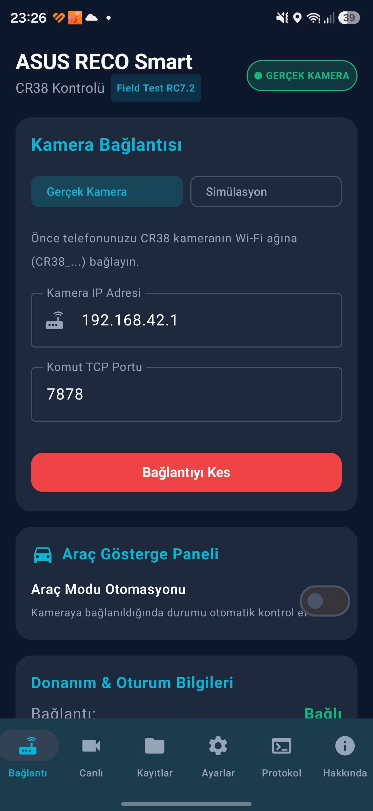
  &nbsp;&nbsp;&nbsp;&nbsp;
  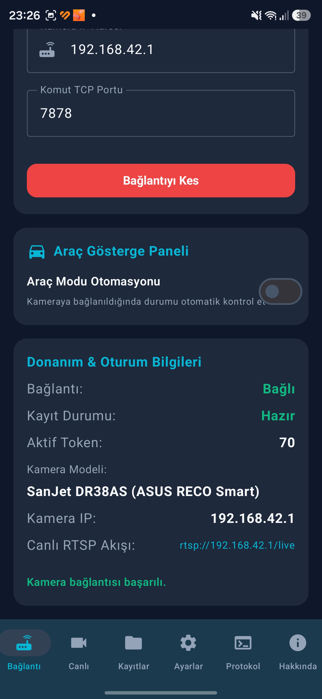
</p>

<p align="center">
  <b>Bağlantı Paneli ve Araç Göstergesi</b> &nbsp;&nbsp;&nbsp;&nbsp;&nbsp;&nbsp;&nbsp;&nbsp;&nbsp;&nbsp;&nbsp;&nbsp;&nbsp;&nbsp;&nbsp;&nbsp;&nbsp;&nbsp;&nbsp;&nbsp;
  <b>Donanım ve Oturum Bilgileri</b>
</p>

### 📹 Canlı Görüntü ve Kayıt
<p align="center">
  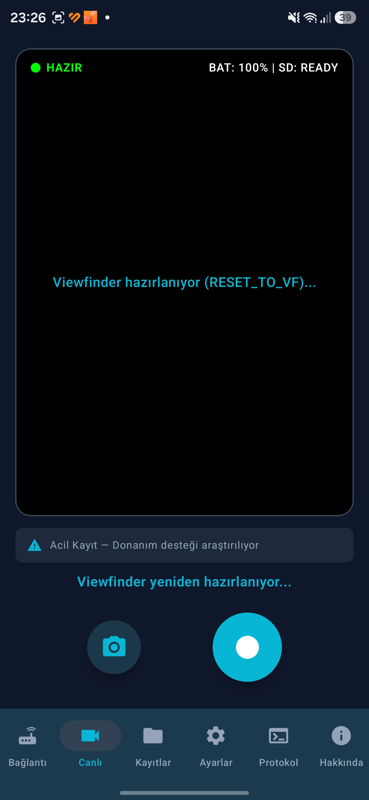
  &nbsp;&nbsp;&nbsp;&nbsp;
  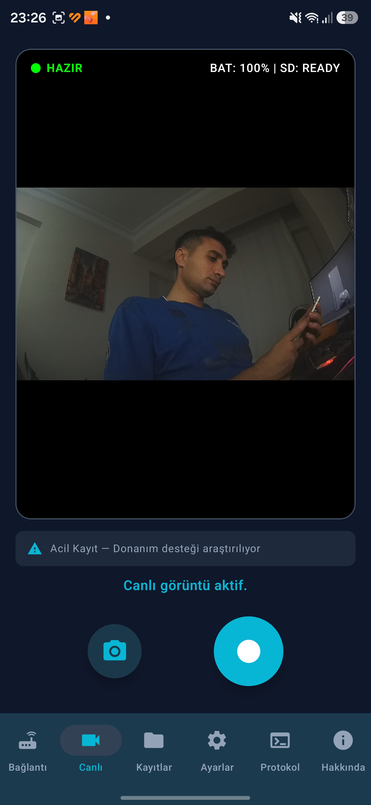
</p>

<p align="center">
  <b>Viewfinder Başlatma (RESET_TO_VF)</b> &nbsp;&nbsp;&nbsp;&nbsp;&nbsp;&nbsp;&nbsp;&nbsp;&nbsp;&nbsp;&nbsp;&nbsp;&nbsp;&nbsp;&nbsp;&nbsp;&nbsp;&nbsp;
  <b>RTSP Canlı Görüntü ve Kayıt</b>
</p>

### 📁 Medya Yöneticisi
<p align="center">
  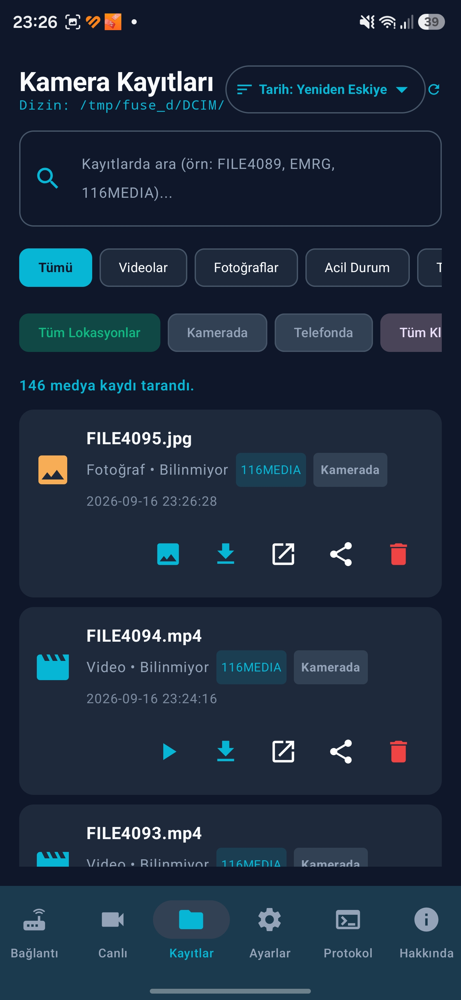
</p>

<p align="center">
  <b>SD Kart Dosya Yöneticisi, Arama ve Filtreler</b>
</p>

### ⚙️ Kamera Ayarları
<p align="center">
  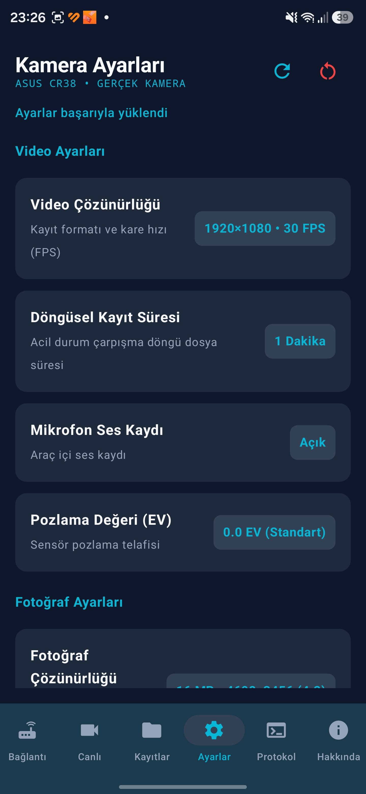
  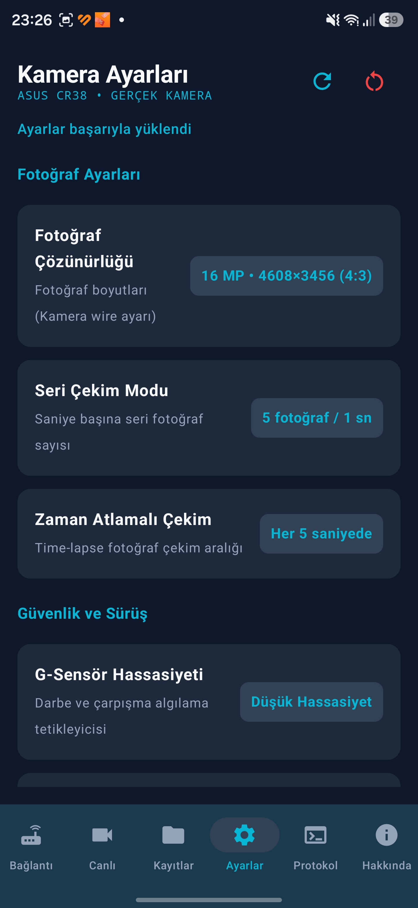
  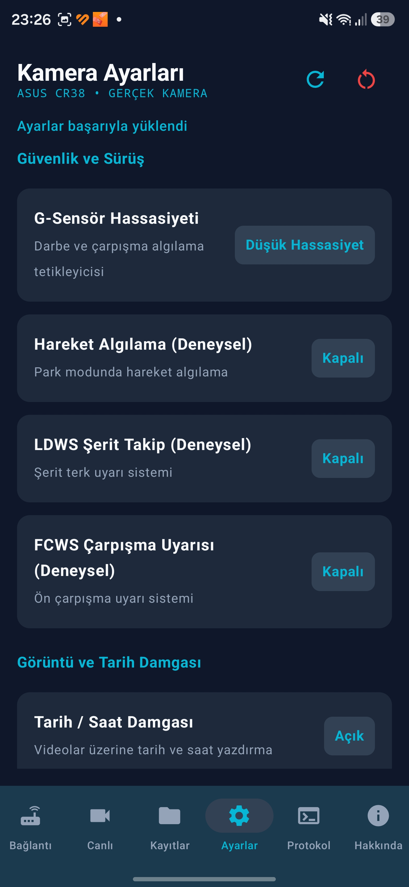
</p>
<p align="center">
  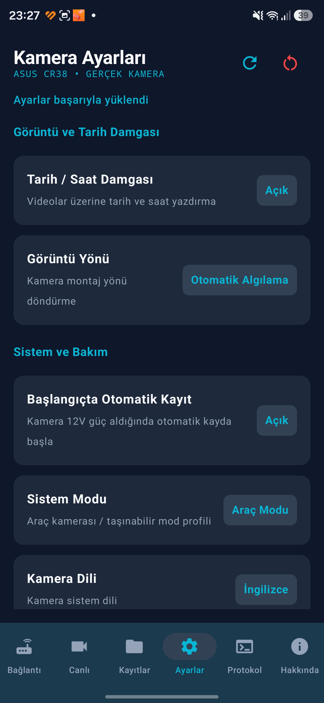
  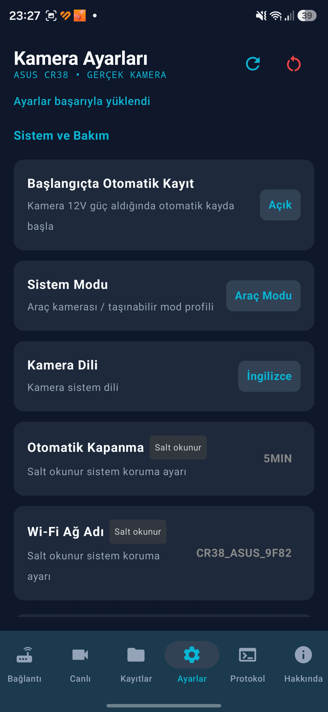
  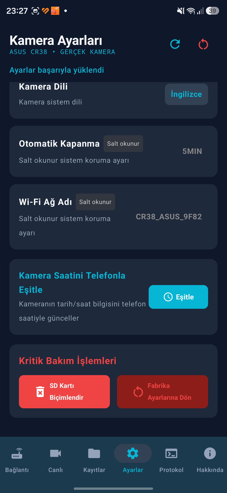
</p>

### 🛠️ Tanılama ve Hakkında
<p align="center">
  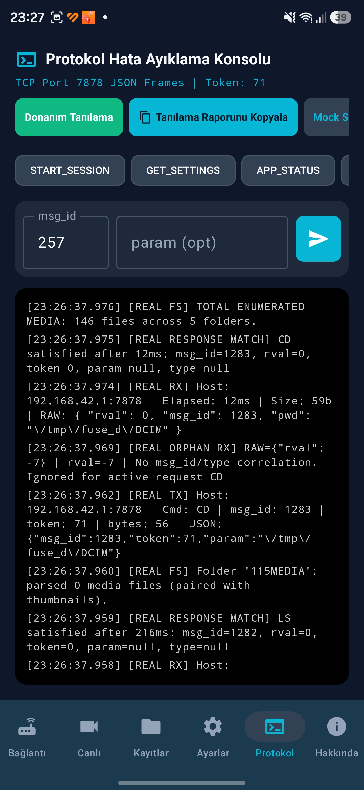
  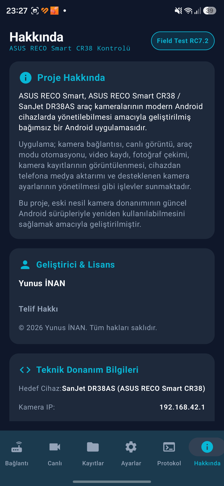
  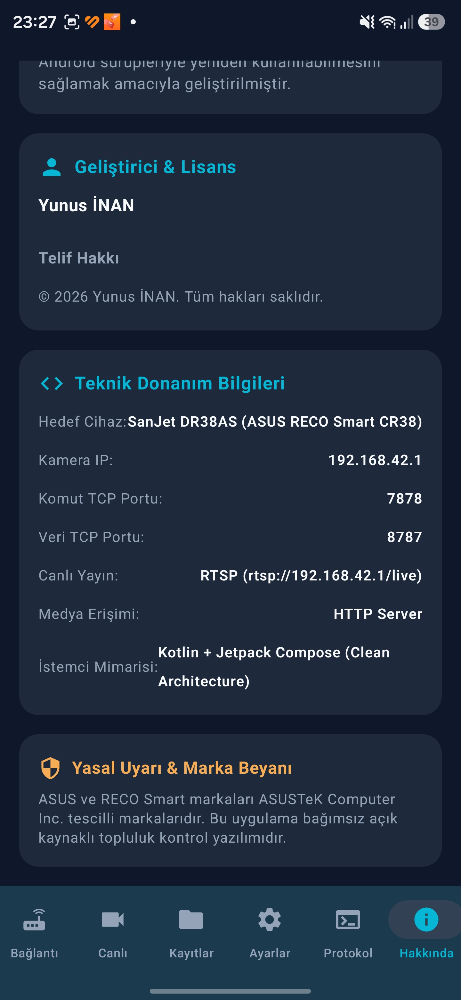
</p>

---

## 🏗️ Mimari

Uygulama, **Clean Architecture** ve **MVVM (Model-View-ViewModel)** prensiplerine uygun olarak tasarlanmıştır:

```text
               Android UI (Jetpack Compose)
                            │
                       ViewModel
                            │
                    CameraRepository
                   /                \
  MockCameraRepository            DefaultCameraRepository
  (Çevrimdışı Simülasyon)                 │
                                  ├── CameraNetworkManager (Wi-Fi Soket Kilidi)
                                  ├── TcpSocketClient (Port 7878 Soket Motoru)
                                  ├── SessionManager (Token Yönetimi)
                                  └── Protocol Parsers (JSON Framer / Serializer)
                                          │
                                          ▼
                                SanJet DR38AS / CR38
```

---

## 🌐 Kamera Haberleşme Parametreleri

| Parametre | Standart Değer | Açıklama |
| :--- | :--- | :--- |
| **Kamera IP Adresi** | `192.168.42.1` | CR38 Wi-Fi Ağındaki Varsayılan İletişim IP'si |
| **Komut Portu (TCP)** | `7878` | JSON Komut ve Yanıt Protokol Soketi |
| **Veri Portu (TCP)** | `8787` | Dosya Aktarım ve Binary Veri Kanalı |
| **RTSP Canlı Yayın** | `rtsp://192.168.42.1/live` | H.264 Canlı Video Akış Adresi |
| **DCIM Kök Dizini** | `/tmp/fuse_d/DCIM/` | SD Kart Ortam Dosyaları Ana Dizini |

---

## 🛠️ Kullanılan Teknolojiler

- **Dil**: Kotlin 1.9+
- **Kullanıcı Arayüzü**: Jetpack Compose (Material Design 3)
- **Asenkron Motor**: Kotlin Coroutines & Flow
- **Medya / Video**: AndroidX Media3 / ExoPlayer (RTSP Support)
- **Ağ / Soket**: Java/Android TCP Sockets, `ConnectivityManager` Network Binding
- **Derleme Sistemi**: Gradle 8.14 (Kotlin DSL)

---

## 🚀 Geliştirme ve Derleme

```cmd
:: Birincil birim testlerini çalıştırma
$env:JAVA_HOME="C:\Program Files\Android\Android Studio\jbr"; .\gradlew.bat test

:: Debug APK paketini oluşturma
$env:JAVA_HOME="C:\Program Files\Android\Android Studio\jbr"; .\gradlew.bat clean assembleDebug
```

Derlenen APK dosyası `app/build/outputs/apk/debug/app-debug.apk` konumunda oluşturulur.

---

## 👨‍💻 Geliştirici & Telif Hakkı

- **Geliştirici**: Yunus İNAN
- **Yıl**: 2026

---

## ⚖️ Yasal Uyarı

Bu proje bağımsız bir araştırma ve geliştirme çalışmasıdır.  
**ASUS ve RECO Smart markaları ASUSTeK Computer Inc. tescilli markalarıdır. Bu uygulama bağımsız açık kaynaklı topluluk kontrol yazılımıdır.**

---

# 🇬🇧 English

# ASUS RECO Smart / CR38 Android Client

## 📱 About the Project

**ASUS RECO Smart / CR38 Android Client** is an independent, unofficial Android application developed for remote control, RTSP live view streaming, vehicle automation, camera storage management, and low-level TCP protocol diagnostics of the **ASUS RECO Smart (CR38 / SanJet DR38AS)** Action & Dash Camera via its local Wi-Fi Access Point network.

Built from scratch using modern Android architecture (**Kotlin**, **Jetpack Compose**, **MVVM**, **Coroutines**, and **Media3/ExoPlayer**).

---

## 🎯 Hardware Physical Verification Status (Field Test RC7.2 Baseline & RC7.3 Updates)

Field Test RC7.2 has been **physically tested and fully verified on real ASUS RECO Smart CR38 / SanJet DR38AS hardware.** Field Test RC7.3 adds media HTTP path resolution diagnostics and robust refresh UX.

### Added Features in Field Test RC7.3:

- 🔄 **Centralized Media HTTP URL Resolver (`CameraMediaUrlResolver`)**: Centralized HTTP URL resolution guaranteeing exact case preservation for folder and filename, with safe URL encoding.
- 🔄 **Raw HTTP Diagnostics Logging**: Diagnostic logs prefixed with `[MEDIA]` capturing URL and HTTP status code during photo preview, video playback, download, caching, and sharing.
- 🔄 **Enhanced HTTP 404 Error Handling**: Structured error state card with `[Retry]` and `[Refresh]` buttons instead of a blank/black player or 00:00 duration when HTTP media is unavailable (404 Not Found).
- 🔄 **Manual & Native Pull-to-Refresh**: Refresh button on Camera Records and native Compose Pull-to-Refresh support.
- 🔄 **Recording-Safe Media Refresh**: Enumerating files never sends `RECORD_STOP`, `STOP_VF`, or `RESET_TO_VF`; active camera recording remains completely uninterrupted.
- 🔄 **Stable File Identity & Deduplication**: Unique identity via folder + filename (`remoteIdentity`) preventing file duplication across folder listings.

### Physically Verified Features on Hardware (RC7.2):

- ✅ **CR38 Connection & Socket Setup**: Fully compatible communication over `192.168.42.1:7878` TCP command port.
- ✅ **Session Management**: `START_SESSION` and dynamic session token acquisition.
- ✅ **Live Preview**: H.264 live RTSP stream via `rtsp://192.168.42.1/live`.
- ✅ **Video Recording & Lifecycle**: Recording start (`RECORD_START`) and uninterrupted continuation across tab navigation.
- ✅ **Seamless Tab Navigation**: Navigating between `Live`, `Records`, `Settings`, `Protocol`, and `About` tabs keeps physical camera recording active.
- ✅ **Explicit Recording Stop**: Recording stops cleanly only when the user explicitly presses the Stop Recording button (`RECORD_STOP`).
- ✅ **Automatic MP4 Discovery**: Automatic detection of the newly created MP4 file after recording stops.
- ✅ **Photo Capture**: Photo capture (`TAKE_PHOTO`) and saving to SD card.
- ✅ **SD Card Storage Management**: Scanning and enumerating folders and media files in root directory (`/tmp/fuse_d/DCIM/`).
- ✅ **Internal Media Player**: HTTP streaming playback of recorded videos inside the app.
- ✅ **Media Export & Download**: Downloading camera files to the Android device and registering with MediaStore.
- ✅ **External Open & Share**: Exporting downloaded media via Android Sharesheet.
- ✅ **Advanced Search & Filtering**: Instant case-insensitive search, dynamic chip filters, and sorting options.
- ✅ **Vehicle Mode Automation**: Automated status checks and vehicle profile configuration.
- ✅ **Camera Settings**: Updating video resolution, loop recording, mic audio, EV exposure, photo resolution, G-sensor sensitivity, date stamp, auto power off, and time sync on physical hardware.

---

## ⚙️ Recording Lifecycle Hardware Discovery (RC7.2)

> **💡 Technical Note:**  
> On the CR38 hardware, `STOP_VF` (msg_id 260) can affect the hardware video encoder pipeline in addition to the RTSP viewfinder.  
> RC7.2 decouples Android-side preview lifecycle from physical recording, allowing recording to continue across application tab navigation.

---

## ✨ Features (Field Test RC7.2)

- **Recording Lifecycle Decoupling**:
  - Leaving `LivePreviewScreen` (`onDispose`) releases only local Android `ExoPlayer` memory without sending camera-side `STOP_VF` (msg_id 260) or `RESET_TO_VF` (msg_id 259) commands.
  - Tab navigation (`Live` -> `Records`, `Settings`, `Connection`, `Protocol`, `About`) preserves physical camera MP4 recording uninterrupted.
  - Re-entering Live Preview while recording (`isRecording == true`) bypasses destructive `RESET_TO_VF` pipeline resets, attaching directly to `rtsp://192.168.42.1/live`.
- **Command Origin Tracking**:
  - All protocol log lines contain explicit origins (e.g., `[CMD][origin=USER_RECORD_BUTTON] RECORD_START msg_id=513`, `[CMD][origin=LIVE_SCREEN_ENTER] RESET_TO_VF`).
- **Safe Recording Completion & Instant File Discovery**:
  - Only explicit user Stop button action sends `RECORD_STOP`, followed by filesystem stabilization wait (~800 ms) and automatic new file discovery.
- **Camera Records Local Search & Sorting**:
  - Case-insensitive local search and flexible sorting (Date, Name, Folder).
- **Advanced Filtering & Dynamic Folder Filters**:
  - Responsive horizontal chip layout for Category, Location, and Folder filters.

---

## 📱 Application Screenshots

### 🔗 Connection & Hardware Info
<p align="center">
  
  &nbsp;&nbsp;&nbsp;&nbsp;
  
</p>

<p align="center">
  <b>Connection Dashboard & Vehicle Panel</b> &nbsp;&nbsp;&nbsp;&nbsp;&nbsp;&nbsp;&nbsp;&nbsp;&nbsp;&nbsp;&nbsp;&nbsp;&nbsp;&nbsp;&nbsp;&nbsp;&nbsp;&nbsp;&nbsp;&nbsp;
  <b>Hardware & Session Info</b>
</p>

### 📹 Live Preview & Recording
<p align="center">
  
  &nbsp;&nbsp;&nbsp;&nbsp;
  
</p>

<p align="center">
  <b>Viewfinder Initialization (RESET_TO_VF)</b> &nbsp;&nbsp;&nbsp;&nbsp;&nbsp;&nbsp;&nbsp;&nbsp;&nbsp;&nbsp;&nbsp;&nbsp;&nbsp;&nbsp;&nbsp;&nbsp;&nbsp;&nbsp;
  <b>Live RTSP Preview & Active Recording</b>
</p>

### 📁 Media Management
<p align="center">
  
</p>

<p align="center">
  <b>SD Card File Manager, Search & Filters</b>
</p>

### ⚙️ Camera Settings
<p align="center">
  
  
  
</p>
<p align="center">
  
  
  
</p>

### 🛠️ Diagnostics & About
<p align="center">
  
  
  
</p>

---

## 🏗️ Architecture

The app follows **Clean Architecture** and **MVVM (Model-View-ViewModel)** principles:

```text
               Android UI (Jetpack Compose)
                            │
                       ViewModel
                            │
                    CameraRepository
                   /                \
  MockCameraRepository            DefaultCameraRepository
  (Offline Simulation)                   │
                                  ├── CameraNetworkManager (Wi-Fi Socket Binding)
                                  ├── TcpSocketClient (Port 7878 Socket Engine)
                                  ├── SessionManager (Token Management)
                                  └── Protocol Parsers (JSON Framer / Serializer)
                                          │
                                          ▼
                                SanJet DR38AS / CR38
```

---

## 🌐 Camera Communication Parameters

| Parameter | Default Value | Description |
| :--- | :--- | :--- |
| **Camera IP Address** | `192.168.42.1` | Default IP on CR38 Wi-Fi Network |
| **Command Port (TCP)** | `7878` | JSON Command & Response Socket |
| **Data Port (TCP)** | `8787` | Data Transfer Channel |
| **RTSP Live Stream** | `rtsp://192.168.42.1/live` | H.264 Live View Stream URL |
| **DCIM Root Directory** | `/tmp/fuse_d/DCIM/` | SD Card Media Root Directory |

---

## 🚀 Building & Setup

```cmd
:: Run unit tests
$env:JAVA_HOME="C:\Program Files\Android\Android Studio\jbr"; .\gradlew.bat test

:: Assemble debug APK
$env:JAVA_HOME="C:\Program Files\Android\Android Studio\jbr"; .\gradlew.bat clean assembleDebug
```

---

## 👨‍💻 Developer & Copyright

- **Developer**: Yunus İNAN
- **Year**: 2026

---

## ⚖️ Legal Disclaimer

This project is an independent research implementation.  
**ASUS and RECO Smart are registered trademarks of ASUSTeK Computer Inc. This application is an independent community project.**
